# **NerazimNet 🛡️✨: Secure Reverse Tunnel Manager**

<p align="center">
  <a href="[https://github.com/nater0000/nerazimnet/releases/latest](https://github.com/nater0000/nerazimnet/releases/latest)"></a>
  &nbsp;
  <a href="[https://github.com/nater0000/nerazimnet/blob/main/LICENSE](https://github.com/nater0000/nerazimnet/blob/main/LICENSE)"></a>
  &nbsp;
  <a href="[https://www.python.org/downloads/](https://www.python.org/downloads/)"></a>
  &nbsp;
  <a href="[https://github.com/nater0000/nerazimnet/actions](https://github.com/nater0000/nerazimnet/actions)"></a>
</p>

NerazimNet is a robust, multi-device reverse tunnel management application for Windows built on **Fast Reverse Proxy (FRP)**. It provides a user-friendly GUI built with **Python** and **CustomTkinter** to securely expose local services to the internet via a remote VPS, using a single QUIC-based `frpc` daemon instead of per-tunnel SSH connections.

<p align="center">
  
</p>

## **Table of Contents**
* [Core Features](#core-features-)
* [1. Installation](#1-installation)
* [2. First-Time Setup](#2-first-time-setup)
* [3. Server Provisioning](#3-server-provisioning-main-workflow)
* [4. Creating & Managing Tunnels](#4-creating--managing-tunnels)
* [5. Other Features & Settings](#5-other-features--settings)
* [6. Technical Specifications](#6-technical-specifications--architecture-)
* [7. Development Setup](#7-development-environment-setup-)

## **Core Features 🚀**

* **One-Click Server Provisioning**: Automatically configures a fresh Linux server with the **frps** daemon (QUIC), Nginx, Certbot, an admin SSH key, and a firewall.  
* **Effortless Tunnel Management**: Create, start, stop, edit, and delete tunnels with a clean, intuitive UI.  
* **Multi-Device Sync**: Uses a bundled **Syncthing** instance to automatically and securely sync your encrypted configuration across all your devices.  
* **Real-Time Status & Logs**: Tunnels show their live status (**Connecting**, **Connected**, **Error**) via the frpc admin API. View detailed FRP daemon logs directly within the app.  
* **Rock-Solid Security**: All configuration is encrypted at rest with a **master password** and a **recovery key** system.  
* **System Tray Integration**: Runs quietly in the background and can be managed from the system tray.

## **1. Installation**

Download the NerazimNet_Installer.exe from the [latest release page](https://github.com/nater0000/nerazimnet/releases). Run the installer and follow the setup wizard.

Step 1: Select Destination Location  
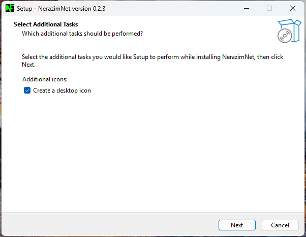

Step 2: Complete the Setup Wizard  
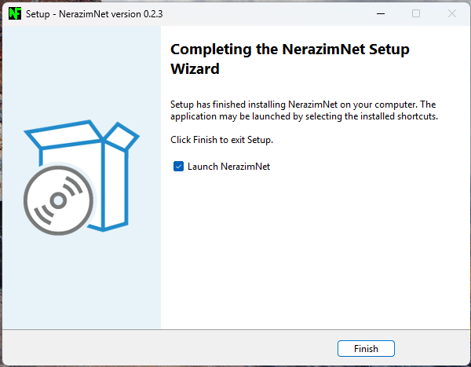

## **2. First-Time Setup**

The first time you launch NerazimNet, you'll be guided through a one-time setup process.

Step 1: Welcome Screen  
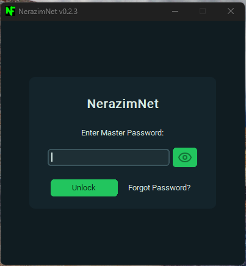

Step 2: Create Master Password  


Step 3: Initializing Services  
The app decrypts your config store and starts the embedded Syncthing service.  
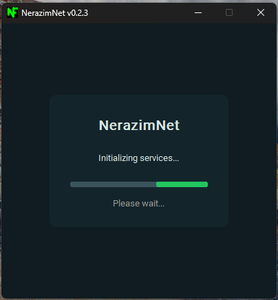

Step 4: Windows Firewall Alert  
During setup, Windows Defender will ask for permission for Syncthing. You must Allow access for multi-device sync to work.  


Step 5: Save Your Recovery Key  
This is the only way to recover your data if you forget your master password. Save it somewhere safe!  
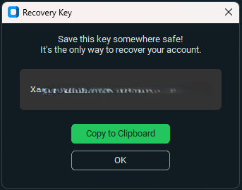

SSH keys are **not** needed until you provision a server. When you start provisioning (Section 3), NerazimNet auto-generates a 2048-bit RSA pair if none exists — or you can create one anytime via **Settings -> SSH Keys -> "Generate New Key Pair"**. Keys live at `%APPDATA%\NerazimNet\ssh_keys`.

## **3. Server Provisioning (Main Workflow)**

Once setup is complete, you must register and provision a server.

Step 1: Go to the Servers Tab  
Go to the Servers (🖥️ icon) tab. It will be empty.  
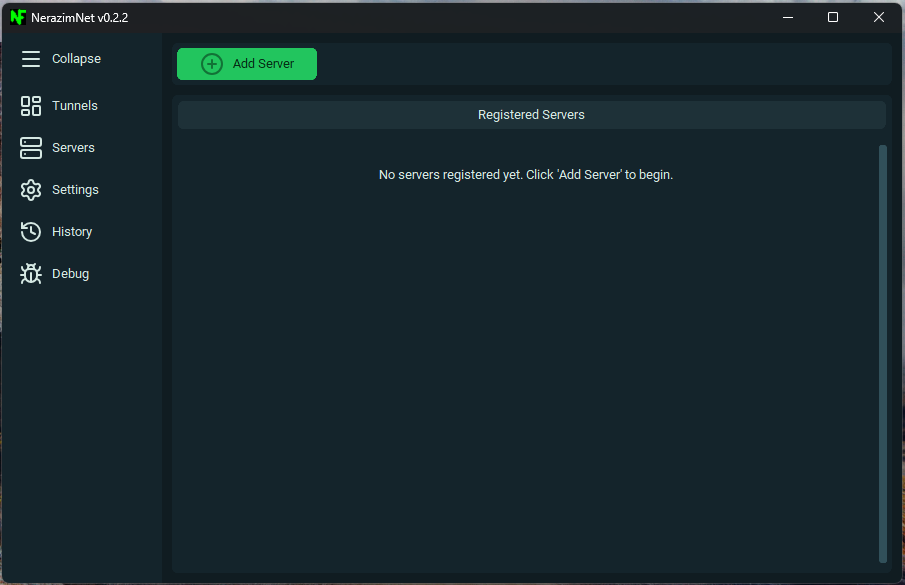

Step 2: Add New Server  
Click "Add Server". Required fields are **Server Name** and **IP Address / Host**. Two optional fields matter for route sync later:

* **Admin User:** the sudo-capable account your automation SSH key was installed for (auto-filled by provisioning).
* **Certbot Email:** the Let's Encrypt registration email used for certificates.

If the server is already fully configured outside the app, tick **"I have manually configured this server (Ready)"** to skip provisioning. Click Save.  
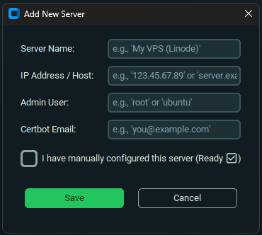

Step 3: Begin Provisioning  
Your server will appear in the list with the status "⚠️ Setup Needed". Click the Wrench (🔧) icon to begin provisioning.  


A dialog will ask for the server's **administrative credentials** (e.g., root user and password) and an email for your Let's Encrypt SSL certificates. The **password is used one time only** and is **never saved** — during provisioning the app installs your automation public key for the admin user so all future server operations are passwordless.

Provisioning installs and configures: **frps** (systemd service, QUIC + TCP on port 7000, token auth), **Nginx**, **Certbot**, and **UFW** rules. The server's **Admin User** and **Certbot Email** are stored on the server record for later route syncs, and the status changes to **"✅ Ready"** when complete.

Note: If provisioning fails with a key error, generate or point to keys via **Settings -> SSH Keys** ("Generate New Key Pair" button).  


## **4. Creating & Managing Tunnels**

Once your server is "Ready," you can create tunnels.

Step 1: Go to the Tunnels Tab  
Go to the Tunnels (🔀 icon) tab. It will be empty.  
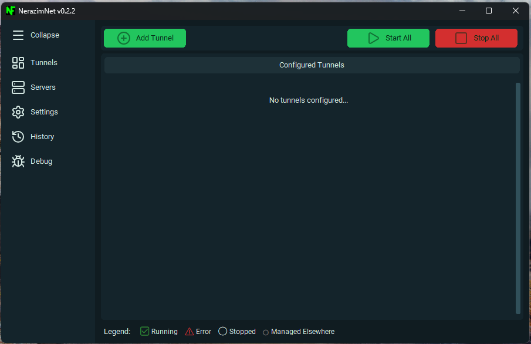

Step 2: Add New Tunnel  
Click "Add Tunnel". Fill in the details for your local service.

* **Route Type:** *Tunnel to Device* exposes a service on a synced device via FRP. *Local VPS Service* fronts a service already running on the VPS itself — no tunnel needed, Nginx proxies to it directly.
* **Hostname:** The public domain you want (e.g., service.mydomain.com). DNS must already point at your VPS.
* **Server:** Your newly provisioned server.
* **Remote Port:** The internal FRP proxy port on the VPS (e.g., 8080). Nginx fronts it publicly at `https://hostname` — visitors never see this port.
* **Client Device:** (Tunnel type only) Select "(This Device)".
* **Local Destination:** (Tunnel type only) Your local service (e.g., 127.0.0.1:8080).
* **Extra Service Ports:** Optional comma-separated `[scheme:]remote:local` pairs for additional ports (e.g., `7880:localhost:7880, raw:7881:localhost:7881`). `raw:`/`tcp:`/`udp:` ports are forwarded at layer 4 via Nginx stream; the rest get HTTPS server blocks.
* **Auto-start on this device:** Starts the tunnel automatically when the app launches.

**On Save**, NerazimNet synchronizes the server's Nginx config and requests the SSL certificate over admin SSH (using your automation key — no password needed once provisioned).

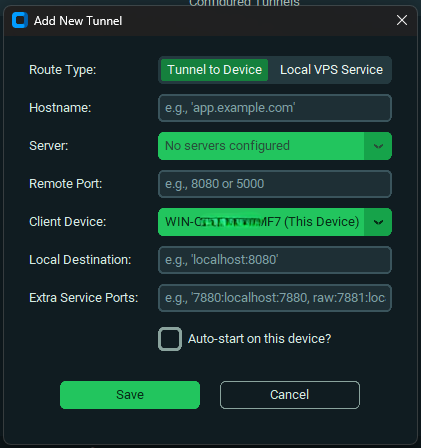  
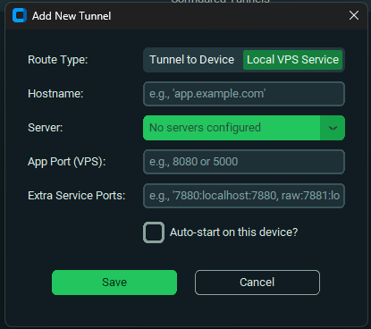

Step 3: Start Your Tunnel  
The new tunnel will appear in your dashboard in the "Stopped" state. Click the Start (▶️) button — the shared `frpc` daemon picks it up via hot reload and the status moves through **Connecting** → **Connected**.


Step 4: Manage Your Tunnel  
You can manage the running tunnel using the action buttons:

* **Edit (✏️):** Opens the Edit dialog.  
* **Logs (📄):** Opens the live log viewer for that tunnel.  
* **Delete (🗑️):** Deletes the tunnel.

  


## **5. Other Features & Settings**

NerazimNet includes several other views for managing your application.

### **App Management**

Collapsible Sidebar  
Click "Collapse" to get more space.  
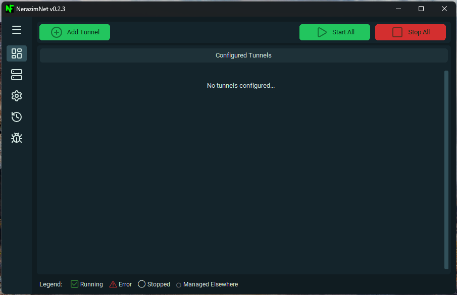

System Tray  
The app runs in the system tray.  
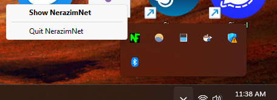

### **Settings Tabs**

Settings -> Devices  
Invite other devices to sync your config.  
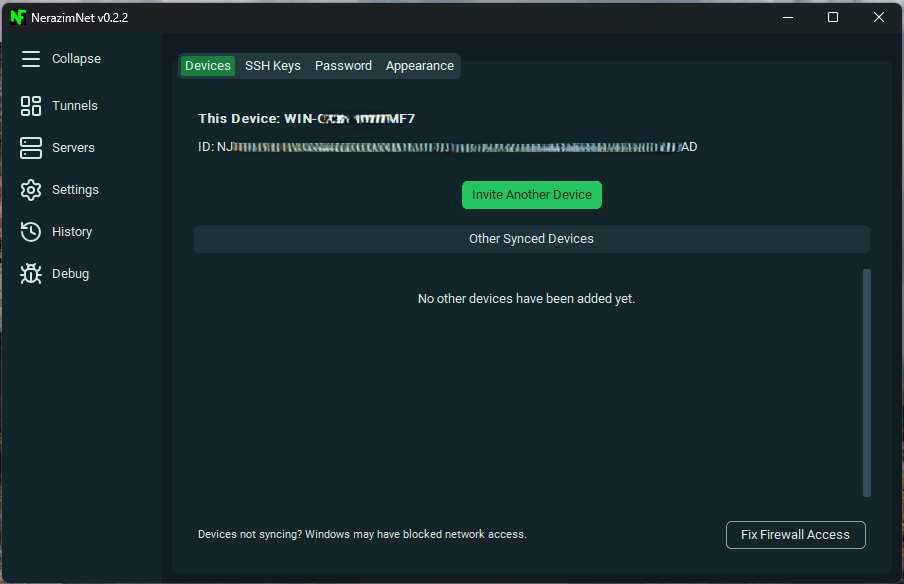

Settings -> SSH Keys  
These keys back **administrative SSH** for server provisioning and route sync — tunnels themselves run over FRP/QUIC, not SSH. Use **"Generate New Key Pair"** to create a pair, or browse to existing keys.  
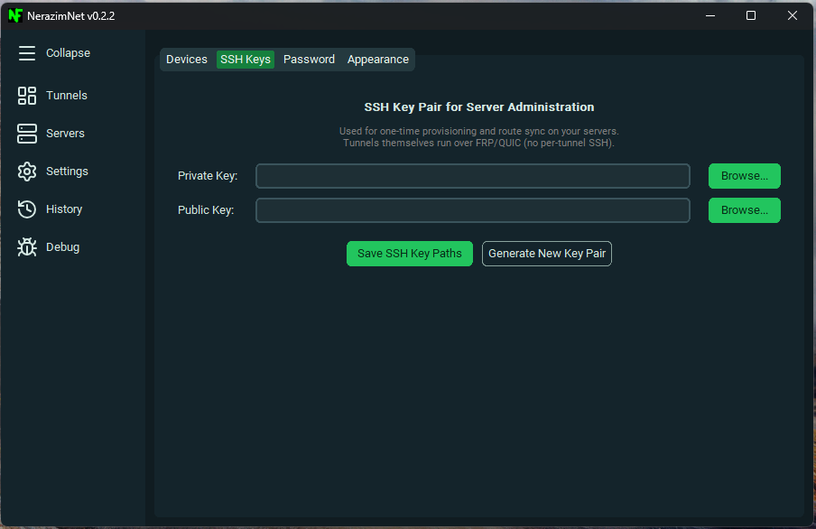

Settings -> Password  
Manage your master password and view your recovery key.  
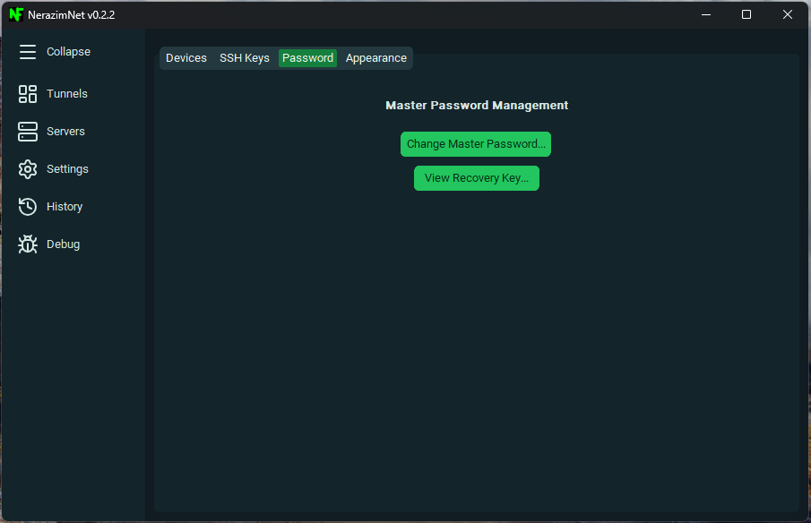

Settings -> Appearance  
Change the app theme.  
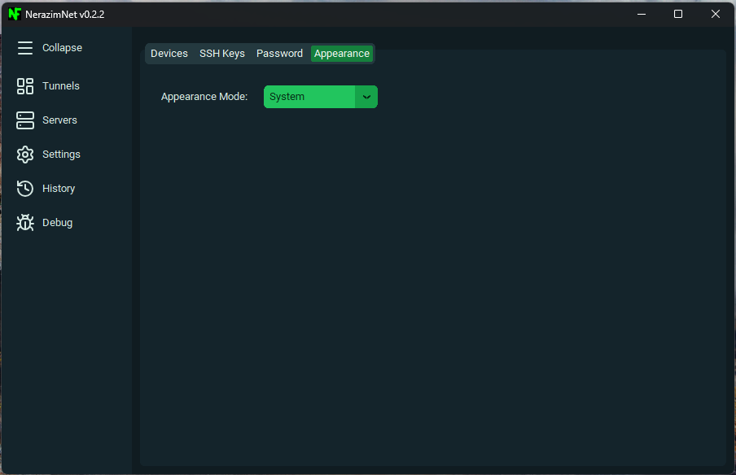

### **History & Debugging**

History View  
Audit all configuration changes over time.  
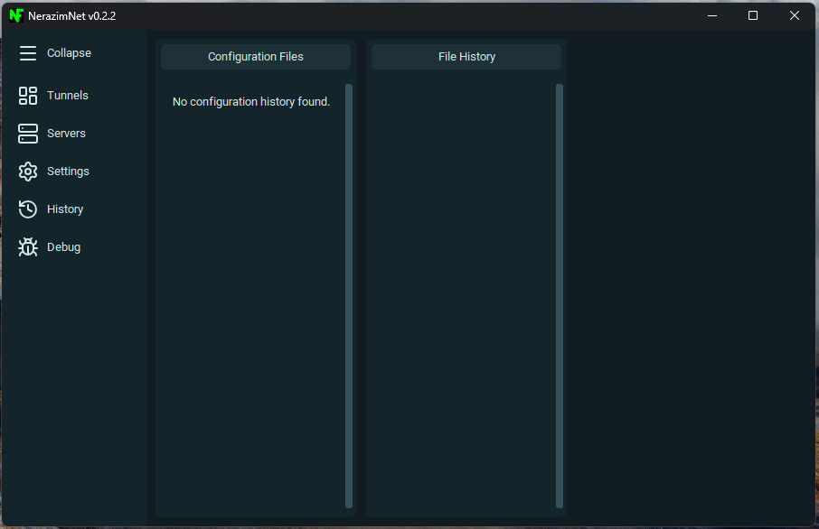

Debug View  
View the raw, in-memory config objects.  
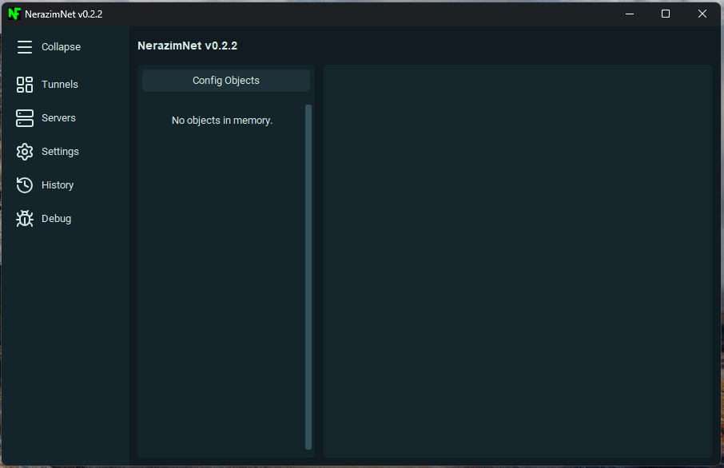

(Note: The Edit Server dialog is also available from the Servers tab.)  


## **6. Technical Specifications & Architecture ⚙️**

NerazimNet is architected around a decentralized, encrypted, and auditable configuration system, managed by a set of specialized controllers.

### **6.1 Security and Cryptography (CryptoManager)**

All configuration data is encrypted at rest to maintain confidentiality, integrity, and non-repudiation.

| Component | Specification | Description |
| :---- | :---- | :---- |
| **Data Encryption** | **AES-256 Symmetric Encryption** (via Fernet) | All configuration objects are individually encrypted before being written to disk. |
| **Key Derivation** | **PBKDF2-HMAC-SHA256** | The encryption key is derived from the Master Password using **480,000 iterations** to resist brute-force attacks. |
| **SSH Keys** | **RSA 2048-bit Key Pair** | Automatically generated with public_exponent=65537. Keys are stored securely at %APPDATA%\\NerazimNet\\ssh_keys. |
| **FRP Token** | **32-char random secret** | Generated once via `secrets.token_urlsafe` and stored encrypted in `credentials.json`; authenticates frpc→frps. |
| **Recovery System** | **Encrypted Recovery Key** | Provides a unique, high-entropy key as the sole mechanism for data recovery if the Master Password is lost. |

### **6.2 Tunnel Execution and Control (TunnelManager)**

The TunnelManager manages a single background **frpc.exe** daemon per server on the client device.

* **FRP Client**: Execution relies on the bundled **frpc.exe** binary (resources/frp), configured via a dynamically generated `frpc.toml` in `%APPDATA%\NerazimNet\frp`.  
* **QUIC Transport**: Tunnels multiplex over a single QUIC (UDP/7000) connection with TLS, eliminating per-tunnel port collisions and reducing latency.  
* **Hot Reload**: Starting or stopping a tunnel rewrites `frpc.toml` and issues `frpc reload`, adopting new routes without dropping other proxies.  
* **Status via Admin API**: Tunnel health is read from each daemon's frpc admin API (`/api/status` on 127.0.0.1, ports allocated from 7400 upward per server) rather than fragile process scraping.  
* **Real-time Logging**: Daemon output is collected asynchronously into a **collections.deque** structure for memory-efficient, real-time logging, viewable within the app.  
* **Graceful Termination**: Ensures clean resource release by using the **Windows API call ctypes.windll.kernel32.GenerateConsoleCtrlEvent** to send a reliable CTRL_CLOSE signal to the frpc process group.

### **6.3 Data Persistence & Synchronization (ConfigManager & SyncthingManager)**

Configuration state is decentralized, version-controlled, and synchronized across devices.

* **Storage Location**: All encrypted data is stored at **%APPDATA%\\NerazimNet\\SyncData**.  
* **File Indexing**: The ConfigManager maintains a central **_index.json** file for efficient lookup of all configuration objects (tunnels, servers, devices).  
* **Version History**: Changes are recorded as lightweight **patch files** (e.g., YYYYMMDDTHHMMSS_file_id.patch) generated using the **diff-match-patch** library.  
* **Synchronization**: The application manages an embedded **Syncthing** binary, controlling the P2P sync process via its **REST API**.

### **6.4 Automated Server Provisioning (ServerProvisioner)**

The ServerProvisioner uses **Fabric** to execute secure, idempotent setup on a remote Linux VPS.

* **Services Provisioned**: Installs and configures **frps** (as a systemd service), **Nginx**, **Certbot**, and **UFW**.  
* **Firewall Policy**: UFW is configured to allow inbound traffic on **TCP/22** (admin SSH), **TCP/80**, **TCP/443**, and **7000 TCP+UDP** (FRP control channel + QUIC).  
* **Route Sync**: Nginx server blocks and Let's Encrypt certificates are provisioned up-front over admin SSH whenever a tunnel is saved, instead of lazily on connect.  
* **Key-Based Admin Access**: The automation public key is deployed to the admin user during provisioning, with scoped NOPASSWD sudo rules for route sync.  
* **Configuration Templating**: **Jinja2** is used to dynamically generate and deploy `frps.toml` and Nginx configuration files on the remote server.

## **7. Development Environment Setup 🧑‍💻**

### **Prerequisites**

* **Python 3.10+**
* **Git**

### **Project Setup**

1. **Clone the Repository**:
```bash
   git clone https://github.com/nater0000/nerazimnet.git  
   cd nerazimnet
```

2. **Initialize Virtual Environment**:
   It is strongly recommended to use a virtual environment to manage dependencies.

   * **Windows:**
     ```powershell
     python -m venv venv
     .\venv\Scripts\activate
     ```
   * **macOS / Linux:**
     ```bash
     python3 -m venv venv
     source venv/bin/activate
     ```

3. **Install Dependencies**:
   The project uses `pyproject.toml` for dependency management. Install in editable mode:
```bash
   pip install -e .
```

4. **Run the Application**:
```bash
   python src/main.py
```

5. **Building the Executable**:
   The `build.py` script uses **PyInstaller** to package the application, explicitly including resources (`resources/syncthing`, `resources/server-setup`, etc.) via the `--add-data` flag.
```bash
   python scripts/build.py
```
